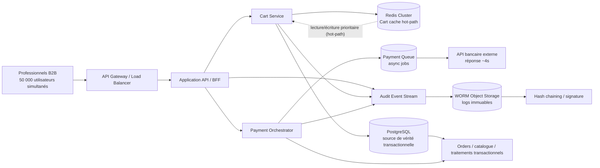

# Architecture MegaShop-B2B

## Diagramme Mermaid

## Légende et justification par contrainte

- API Gateway / Load Balancer : supporte la charge attendue de 50 000 utilisateurs simultanés et répartit la charge sans introduire de logique métier complexe. Alternative sérieuse envisagée : passer directement à l'API backend sans edge. Elle a été écartée car elle laisse moins de contrôle sur la tolérance aux pics et la protection de la couche applicative.

- Application API / BFF : couche stateless qui orchestre les requêtes et protège les services internes. Alternative sérieuse envisagée : exposer directement les services métier. Elle a été écartée parce qu'elle complexifie le couplage et la sécurisation de l'API publique pour un besoin non démontré ici.

- Cart Service + Redis Cluster : répond à la contrainte 1. Le panier est servi depuis un cache mémoire distribué pour rester en dessous de 50 ms, et le cache continue de fonctionner si la base transactionnelle est temporairement indisponible. Alternative sérieuse envisagée : stocker le panier uniquement en base de données relationnelle. Elle a été rejetée car elle impose un chemin critique dépendant de la base principale et ne tient pas la latence cible en cas de saturation ou d'indisponibilité.

- PostgreSQL : base principale de référence pour les données transactionnelles (commandes, stock, client, etc.). Elle conserve la cohérence business, tandis que le panier est déporté sur Redis pour la performance. Alternative sérieuse envisagée : utiliser uniquement une base NoSQL. Elle a été rejetée car la plateforme e-commerce B2B a besoin d'une cohérence transactionnelle solide et d'un modèle relationnel pour les objets métier critiques; un stockage NoSQL ne supprime pas le besoin d'un système durable central.

- Audit Event Stream + WORM Object Storage + hash chaining : répond à la contrainte 2. L'historique complet des actions est capturé en append-only, séparé du système transactionnel pour éviter toute altération par un incident ou une modification malveillante. Alternative sérieuse envisagée : stocker les logs dans la même base relationnelle avec des tables d'audit. Elle a été écartée car ce n'est pas une preuve d'inaltérabilité légale ; un même bac de données rend les journaux vulnérables à des suppressions ou modifications accidentelles ou malveillantes.

- Payment Queue + Payment Orchestrator : répond à la contrainte 3. Le système ne bloque pas l'utilisateur sur un appel de 4 s à l'API bancaire externe ; il accepte la demande, l'enqueue, puis traite en arrière-plan avec retries et idempotence. Alternative sérieuse envisagée : appel synchrone direct à l'API bancaire depuis le flux de checkout. Elle a été rejetée car elle détruit la latence de paiement et le temps de réponse utilisateur, sans nécessité technique justifiée par le besoin métier.

- Orders / catalog / processing : composants métier classiques, conservés dans la base transactionnelle pour garantir la cohérence des commandes et du catalogue. Alternative sérieuse envisagée : dupliquer toutes les données dans plusieurs bases. Elle a été écartée car la complexité aurait été disproportionnée pour les contraintes réellement formulées.

## Synthèse de conception

La conception reste volontairement sobre : pas de microservices dispersés, pas de multi-région non justifié, pas de sur-ingénierie. Chaque choix répond à une contrainte explicite :

1. Panier ultra-rapide et tolérant à la panne DB : Redis hot-path + service de panier isolé.
2. Audit légal inaltérable : flux d'événements + stockage WORM + hachage.
3. Paiement lent : file d'attente asynchrone + orchestration idempotente.

Aucune hypothèse de dimensionnement supplémentaire n'est ajoutée au-delà de celles explicitement présentes dans le contexte : trafic de pointe de 50 000 utilisateurs simultanés et trois contraintes techniques assez nettes.
