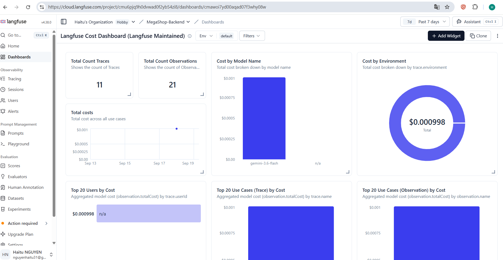
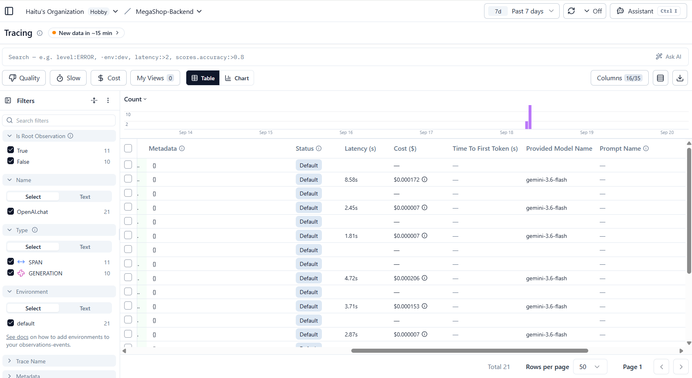

# Revue FinOps de clôture — MegaShop-B2B Backend

Analyse du coût réel des appels LLM effectués pendant les tests de ce
projet, à partir du tableau de bord Langfuse du projet dédié
`MegaShop-Backend`. Données extraites via l'API publique Langfuse
(`GET /api/public/traces`, `GET /api/public/scores`) le 2026-09-18, et
exportées dans `langfuse_traces_export.json` / `.csv` et
`langfuse_scores_export.json`.

## Coût total mesuré

**11 traces** `OpenAI.chat` enregistrées sur ce projet, pour un coût
cumulé de **$0.0009975** (moins d'un dixième de centime).

Ce total se décompose en deux catégories :

| Origine | Nombre d'appels | Coût |
|---|---|---|
| Appels réels de l'application (`worker.js` traitant une vraie transaction en file) | 7 | $0.0009705 |
| Sondes de debug manuelles (diagnostic du bug de stdin de la Task 3, prompt `"dis juste OK"`) | 4 | $0.000027 |

Le coût **attribuable à l'application elle-même** (celui qui compte pour
une revue FinOps de production) est donc **$0.0009705** sur l'ensemble
des Sprints 1 à 3.

**Périmètre de cette revue** : les exports et les captures ci-dessous
figent l'état du projet Langfuse au 2026-09-18 (Sprints 1 à 3, tests
automatisés), soit 11 traces. Un essai manuel interactif du Sprint 3,
réalisé le 2026-09-20 (voir `PROOF.md`), a ajouté ensuite 2 traces
d'analyse (`9dbf12ce…` : $0.0002205, `78d3bafc…` : $0.00020925) et 2 scores
HITL (`1` et `0`) : +$0.00042975, soit un total projet de **$0.00142725**
(13 traces), toujours négligeable. Deux traces supplémentaires ont été
créées le même jour pour prouver le garde-fou budgétaire (`b7307595…` :
$0.0001935, `c63f7724…` : $0.00015975), puis deux autres pour prouver
l'identité de l'opérateur sur les décisions HITL (`8e4d4bb9…` :
$0.00018675, `5c8f98d9…` : $0.0002175). Le total atteint **$0.00218475**
pour **17 traces**. Ces traces ne figurent pas dans les fichiers d'export
ni sur les captures, qui restent cohérents entre eux.

## Vérification visuelle dans le dashboard Langfuse

Le **Langfuse Cost Dashboard** (plage "Past 7 days", projet
`MegaShop-Backend`) confirme le chiffre calculé par API :

- **Total costs** : `$0.000998` (soit `$0.0009975` arrondi, cohérent avec l'export API)
- **Total Count Traces** : `11` — **Total Count Observations** : `21` (11 `SPAN` + 10 `GENERATION`)
- **Cost by Model Name** : 100 % du coût attribué à `gemini-3.6-flash`

Vue tabulaire des observations avec la colonne **Cost ($)** ligne par
ligne (coûts par appel LLM) :

**Pourquoi 11 traces mais seulement 10 `GENERATION`** : la trace
`0a2edd88` (coût `0`) correspond à un appel du Worker qui n'a jamais reçu
de réponse pendant les tests du Sprint 3 (blocage réseau ponctuel, ~110 s
sans retour avant que le conteneur soit arrêté à la main). Vérifié via
l'API : cette trace a un `input` mais `output: null` et zéro observation,
donc aucune génération n'a été enregistrée ni facturée. Aucun coût perdu
ni caché — l'appel n'a simplement jamais abouti.

## Détail par trace

| Horodatage (UTC) | Trace | Coût ($) | Décision humaine (HITL) |
|---|---|---|---|
| 08:44:27 | `87ff1762` | 0.00014475 | — |
| 09:14:10 | `1a98d8d5` | 0.00016050 | — |
| 09:16:06 | `ac3e0794` | 0.00013425 | — |
| 09:18:27 | `a4af4cbe` | 0.00000675 | *(sonde debug)* |
| 09:19:00 | `7d1ef0af` | 0.00000675 | *(sonde debug)* |
| 09:20:00 | `92702055` | 0.00015300 | ✅ autorisé (`value: 1`) |
| 09:20:44 | `360f7301` | 0.00020625 | ❌ refusé (`value: 0`) |
| 09:21:21 | `0a2edd88` | 0 | — *(appel bloqué sans réponse, voir ci-dessus)* |
| 09:23:43 | `b9bd241e` | 0.00000675 | *(sonde debug)* |
| 09:24:04 | `a058003a` | 0.00000675 | *(sonde debug)* |
| 09:24:23 | `aad6070b` | 0.00017175 | — |

Détail complet (`totalCost`, `latency`, input/output bruts) disponible
dans `langfuse_traces_export.json`.

## Traçabilité des décisions HITL (Sprint 3)

Les deux scores `validation_humaine_remboursement` enregistrés pendant
les tests sont chacun rattachés à leur trace d'analyse IA d'origine — pas
de score orphelin :

- `92702055-f219-48de-854f-e58bb3dc595a` → **score 1 (autorisé)**, transaction `tx_refund_accepted`
- `360f7301-cb7a-4af8-9036-ca4f5e1a29d4` → **score 0 (refusé)**, transaction `tx_refund_refused`

Cette correspondance permet, en repartant uniquement de
`langfuse_scores_export.json`, de retrouver via le `traceId` l'appel LLM
exact (prompt, réponse, coût) qui a précédé chaque décision humaine —
c'est l'objectif même de cette clôture : pouvoir auditer après coup
n'importe quelle décision de remboursement jusqu'à l'analyse IA et au
coût qui l'ont précédée.

## Conclusion FinOps

Le coût affiché par Langfuse pour l'ensemble des tests (Sprints 1 à 3,
y compris les sondes de debug) est de l'ordre du millième de dollar :
`$0.0009975` sur le périmètre du 18 septembre, `$0.00142725` avec l'essai
manuel du 20. Par analyse aboutie, cela représente environ `$0.00016` (6
analyses sur le périmètre du 18 septembre). À cette échelle, même
plusieurs dizaines de milliers de transactions par mois resteraient un
poste de coût modeste.

### Limites de cette conclusion

- **Consommation en tokens** : les vraies analyses consomment entre 620
  et 946 tokens au total (`total_tokens`, relevé via l'API Langfuse) pour
  seulement 53 à 55 tokens en entrée et 25 à 48 en sortie. La différence
  (~570 tokens par appel) correspond très probablement aux tokens de
  raisonnement du modèle. **8 générations sur 12 dépassent donc un seuil
  de 150 tokens** comme celui du projet `07_langfuse` : un tel seuil
  déclencherait une alerte sur chaque analyse réelle.
- **Le coût affiché est peut-être sous-estimé** : Langfuse le calcule à
  partir des tokens d'entrée et de sortie déclarés (les tarifs déduits
  sont d'environ $0.75 par million en entrée et $3.75 par million en
  sortie), sans compter ces tokens de raisonnement. S'ils sont facturés
  par le fournisseur, le coût réel serait plus élevé que celui affiché.
  Ce point n'est pas vérifié ici : il faudrait le confronter à la
  facturation du fournisseur.
- **Budget appliqué en temps réel depuis le 20 septembre** : le Worker
  compare chaque analyse à un budget en tokens (1 500 par appel, 20 000
  cumulés par exécution, configurables par `FINOPS_MAX_TOKENS_PER_CALL` et
  `FINOPS_TOKEN_BUDGET`), émet une alerte console en cas de dépassement et
  enregistre un score `finops_budget` (`1` respecté, `0` dépassé) sur la
  trace de l'analyse. Ces seuils viennent des mesures ci-dessus : un seuil
  de 150 tokens comme au projet `07_langfuse` alerterait à chaque appel.
  Les tests du 18 septembre (et l'essai manuel du 20) ont été faits
  **avant** ce garde-fou : la revue de ces traces reste rétrospective. Le
  garde-fou lui-même est prouvé dans `PROOF.md`.
