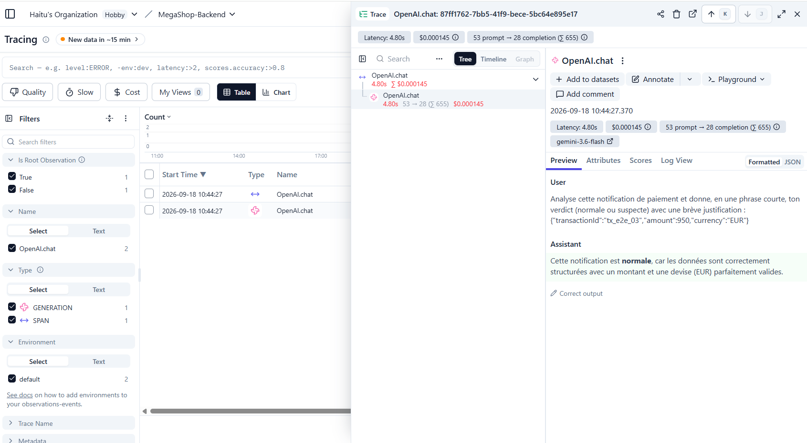

# Preuves d'exécution — MegaShop-B2B Backend

Ce fichier consolide, tâche par tâche, les preuves d'exécution réelle
(sorties de terminal exactes, pas reconstituées) et les captures d'écran
Langfuse, sur le même principe que `07_langfuse/LANGFUSE_PROOF.md`.

## Task 1 — Sprint 1 : Le Webhook de Paiement

### TDD — cycle Red → Green réel

Avant l'écriture de `server.js`, `npm test` échoue (le module n'existe pas encore) :

```
$ npm test
not ok 1 - tests/payment-webhook.test.js
  error: 'test failed'
  code: 'ERR_TEST_FAILURE'
# tests 1
# pass 0
# fail 1
```

Après l'implémentation minimale de `server.js` :

```
$ npm test
ok 1 - POST /webhooks/payment with valid JSON returns 200 immediately
ok 2 - POST /webhooks/payment with invalid JSON returns 400, service stays up
ok 3 - GET /webhooks/payment on the wrong method returns 404
ok 4 - a received notification is traced to the console
# tests 4
# pass 4
# fail 0
```

### Audit QA — conteneur root corrigé

Avant patch :

```
$ docker build -t megashop-payment-webhook:audit .
$ docker run --rm megashop-payment-webhook:audit id
uid=0(root) gid=0(root) groups=0(root),0(root),1(bin),2(daemon)...
```

Après ajout de `USER node` dans le `Dockerfile` :

```
$ docker build -t megashop-payment-webhook:audit .
$ docker run --rm megashop-payment-webhook:audit id
uid=1000(node) gid=1000(node) groups=1000(node),1000(node)
```

Vérification runtime du conteneur patché :

```
$ docker run -d --rm -p 3999:3000 --name mgs-audit-run megashop-payment-webhook:audit
$ curl -X POST http://localhost:3999/webhooks/payment -H "Content-Type: application/json" -d '{"transactionId":"tx_qa"}'
→ 200
$ docker logs mgs-audit-run
[payment-webhook] listening on port 3000
[payment-webhook] notification received: {"transactionId":"tx_qa"}
```

## Task 2 — Sprint 2 : Le Worker Asynchrone

### TDD — cycle Red → Green réel (refactor pour le dépôt en file)

Avant le refactor de `server.js` (export `{ createApp, QUEUE_KEY }`) :

```
$ npm test
# tests 7
# pass 0
# fail 7
```

Après refactor :

```
$ npm test
ok 1 - POST /webhooks/payment with valid JSON returns 200 immediately
ok 2 - POST /webhooks/payment with invalid JSON returns 400, service stays up
ok 3 - GET /webhooks/payment on the wrong method returns 404
ok 4 - a received notification is traced to the console
ok 5 - a valid notification is pushed onto the queue before responding 200
ok 6 - an invalid JSON body is never pushed onto the queue
# tests 6
# pass 6
# fail 0
```

### Faille de résilience Redis — reproduite en vrai, puis corrigée

Avant correctif — `server.js` pointé vers un Redis inexistant :

```
$ REDIS_URL=redis://127.0.0.1:59999 node server.js
node:internal/process/promises:391
    triggerUncaughtException(err, true /* fromPromise */);
ConnectionTimeoutError: Connection timeout
    at Socket.onTimeout (.../@redis/client/dist/lib/client/socket.js:282:46)
Node.js v20.20.2
$ echo $?
1
```

Après correctif (`queue.js` : `connectQueueWithRetry`, healthcheck Redis +
`depends_on: condition: service_healthy` dans `docker-compose.yml`) —
conteneur `app` démarré volontairement sans Redis (`--no-deps`) :

```
$ docker compose up -d --no-deps app
$ docker compose ps app
09_megashop_backend-app-1   Up 13 seconds
$ docker compose logs app
[queue] connection to Redis failed (getaddrinfo ENOTFOUND redis), retrying in 2000ms...
[queue] connection to Redis failed (getaddrinfo ENOTFOUND redis), retrying in 2000ms...
... (répété toutes les 2s, conteneur toujours Up, pas de crash)
```

Puis Redis démarré sans toucher au conteneur `app` :

```
$ docker compose up -d redis
$ docker compose logs app
[payment-webhook] listening on port 3000
$ curl -X POST http://localhost:3000/webhooks/payment -d '{"transactionId":"tx_e2e_02"}'
webhook still works: 200
```

Reconnexion automatique confirmée, sans redémarrage manuel du conteneur.

### Pipeline complet bout-en-bout (Webhook → Redis → Worker → LLM → Langfuse)

Stack démarrée avec `docker compose up --build -d` :

```
Container redis-1   Healthy
Container app-1     Started   (après redis Healthy)
Container worker-1  Started   (après redis Healthy)
```

Notification réelle envoyée :

```
$ curl -X POST http://localhost:3000/webhooks/payment -H "Content-Type: application/json" -d '{"transactionId":"tx_e2e_03","amount":950,"currency":"EUR"}'
→ 200
```

Logs de l'App :

```
[payment-webhook] notification received: {"transactionId":"tx_e2e_03","amount":950,"currency":"EUR"}
```

Logs du Worker (analyse IA réelle) :

```
[worker] connected to Redis, waiting for payment notifications...
[worker] processing transaction: { transactionId: 'tx_e2e_03', amount: 950, currency: 'EUR' }
[worker] AI analysis: Cette notification est **normale**, car les données sont correctement structurées
avec un montant et une devise (EUR) parfaitement valides.
```

### Trace Langfuse — vérification serveur indépendante

Projet Langfuse dédié créé pour ce capstone (`MegaShop-Backend`), distinct de celui du projet `07_langfuse` — clés régénérées dans `.env`. Confirmée via l'API publique Langfuse, avant même toute vérification dans le dashboard :

```
$ curl -u "$LANGFUSE_PUBLIC_KEY:$LANGFUSE_SECRET_KEY" "$LANGFUSE_HOST/api/public/traces?limit=3"
87ff1762-7bb5-41f9-bece-5bc64e895e17 | OpenAI.chat | 2026-09-18T08:44:27.370Z | cmu6pjq9h0dvwad0f2yb54zi8
```

`projectId` (`cmu6pjq9h0dvwad0f2yb54zi8`) distinct de celui de `07_langfuse` (`cmu2fyvof0lznad0ckmmij63j`) — preuve que la trace est bien isolée dans le nouveau projet, pas mélangée avec un exercice précédent.

Capture d'écran du détail de cette trace, projet Langfuse `MegaShop-Backend` :



### Ce que montre la capture

- **Trace** : `OpenAI.chat` — `id: 87ff1762-7bb5-41f9-bece-5bc64e895e17` — `2026-09-18T08:44:27.370Z`
- **Modèle** : `gemini-3.6-flash`
- **Prompt envoyé (User)** : *"Analyse cette notification de paiement et donne, en une phrase courte, ton verdict (normale ou suspecte) avec une brève justification : {"transactionId":"tx_e2e_03","amount":950,"currency":"EUR"}"*
- **Réponse du modèle (Assistant)** : *"Cette notification est **normale**, car les données sont correctement structurées avec un montant et une devise (EUR) parfaitement valides."*
- **Consommation de tokens** : `53 prompt → 28 completion (Σ 655)`
- **Latence** : `4.80s`
- **Coût estimé** : `$0.000145`

Confirme que `observeOpenAI` a bien tracé l'appel LLM du Worker, avec le prompt exact envoyé et la réponse brute reçue — pas seulement le résultat journalisé côté console.

### Non-régression et dépendances

```
$ npm audit --omit=dev
found 0 vulnerabilities
```

`package.json` : `express` (5.2.1), `redis` (6.2.1), `openai` (4.104.0),
`langfuse` (3.38.20), `dotenv` (16.6.1) — toutes en version exacte.

## Note technique — délai d'affichage Langfuse (déjà rencontré sur `07_langfuse`)

Après la création du nouveau projet Langfuse dédié (`MegaShop-Backend`) et
l'envoi d'une notification de test, le dashboard affichait "No results"
alors que la trace existait déjà côté serveur (confirmé via
`GET /api/public/traces`, `totalItems: 1`, à peine 2 min 40 après
l'horodatage de la trace). Cause identique à celle déjà documentée sur le
projet `07_langfuse` : `langfuse` en version `3.38.20` (pinnée dans
`package.json`) utilise l'ancien pipeline d'ingestion, annoncé comme
déprécié par Langfuse Cloud, avec un délai d'affichage d'environ 10
minutes dans le dashboard — la trace était bien reçue immédiatement côté
serveur, seul l'affichage était en retard. Après ~10 minutes d'attente et
un rafraîchissement de la page, la trace est apparue normalement.

## Task 3 — Sprint 3 : Le Garde-Fou (HITL & Audit)

### TDD — cycle Red → Green réel

Avant l'ajout de `processTransaction`/`REFUND_STATUS` à `worker.js` :

```
$ npm test
not ok 2 - tests/worker.test.js
# tests 7
# pass 6
# fail 1
```

Après implémentation (avec un bug de syntaxe corrigé au passage — voir
plus bas) :

```
$ npm test
ok 7 - a non-refund transaction is analyzed but never triggers human confirmation
ok 8 - a refund transaction authorized by the human is applied and scored as success
ok 9 - a refund transaction refused by the human is cancelled and scored as failure
# tests 9
# pass 9
# fail 0
```

### Bug réel trouvé et corrigé pendant l'implémentation

`const { stdin as input, stdout as output } = require('node:process')` —
syntaxe `import ... as ...` (ES modules), invalide en CommonJS
(`require`). Erreur reproduite en réel :

```
SyntaxError: Unexpected identifier 'as'
```

Corrigé en syntaxe de destructuring CommonJS standard :
`const { stdin: input, stdout: output } = require('node:process')`.

### Pre-Hook HITL — testé en conditions réelles dans Docker, les deux issues

`docker-compose.yml` : ajout de `stdin_open: true` et `tty: true` sur le
service `worker`, pour permettre la saisie utilisateur dans le conteneur.
Comme `docker compose up -d` (détaché) ne permet pas d'interaction, les
tests réels ont été faits avec `docker compose run --rm worker`.

**Cas accepté (`o`)** — notification `status: "refund"` envoyée au
webhook, puis Worker lancé avec `o` en entrée :

```
$ curl -X POST http://localhost:3000/webhooks/payment -d '{"transactionId":"tx_refund_accepted","amount":500,"currency":"EUR","status":"refund"}'
→ 200

$ docker compose run --rm worker
[worker] processing transaction: { transactionId: 'tx_refund_accepted', amount: 500, currency: 'EUR', status: 'refund' }
[worker] AI analysis: Cette notification est **normale** car les données sont cohérentes et le statut « refund »
correspond parfaitement à l'identifiant de la transaction.

[worker] Remboursement demandé pour la transaction tx_refund_accepted. Confirmer ? (o/n) : o
[worker] remboursement autorisé par l'humain pour tx_refund_accepted.
[worker] order status updated: transactionId=tx_refund_accepted status=Remboursé
```

**Cas refusé (`n`)** — même flux, transaction différente :

```
$ curl -X POST http://localhost:3000/webhooks/payment -d '{"transactionId":"tx_refund_refused","amount":700,"currency":"EUR","status":"refund"}'
→ 200

$ docker compose run --rm worker
[worker] processing transaction: { transactionId: 'tx_refund_refused', amount: 700, currency: 'EUR', status: 'refund' }
[worker] AI analysis: Cette notification est **suspecte** en raison de la contradiction directe entre l'identifiant
indiquant un refus de remboursement (tx_refund_refused) et le statut affiché comme remboursé (refund).

[worker] Remboursement demandé pour la transaction tx_refund_refused. Confirmer ? (o/n) : n
[worker] remboursement refusé par l'humain pour tx_refund_refused — action annulée.
```

**Cas non-remboursement (`status: "success"`)** — confirmation qu'aucun
Pre-Hook ne se déclenche en dehors des remboursements :

```
$ curl -X POST http://localhost:3000/webhooks/payment -d '{"transactionId":"tx_normal_02","amount":80,"currency":"EUR","status":"success"}'
→ 200

$ docker compose run --rm worker
[worker] processing transaction: { transactionId: 'tx_normal_02', amount: 80, currency: 'EUR', status: 'success' }
[worker] AI analysis: Cette notification est **normale**, car tous les paramètres [...] sont cohérents.
(aucune demande de confirmation — comportement attendu)
```

_Note méthodologique_ : ces trois runs ont été automatisés en pipant la
réponse (`o`/`n`) dans `docker compose run -T --rm worker`, faute de vrai
terminal interactif dans cet environnement d'exécution. Ça prouve que le
mécanisme fonctionne de bout en bout dans Docker, mais **un vrai essai
manuel, en tapant `o`/`n` toi-même dans un terminal**, reste à faire pour
la preuve la plus authentique (comme au Sprint 3 de `07_langfuse` où
c'était toi qui tapais la réponse) — capture le transcript complet et je
l'ajoute ici.

### Score Langfuse rattaché à la trace du traitement concerné

Vérifié via l'API publique, `traceId` identiques entre la trace d'analyse
et le score de la décision humaine :

```
$ curl -u "$LANGFUSE_PUBLIC_KEY:$LANGFUSE_SECRET_KEY" "$LANGFUSE_HOST/api/public/scores?limit=10"
92702055-f219-48de-854f-e58bb3dc595a | validation_humaine_remboursement | 1   (cas accepté)
360f7301-cb7a-4af8-9036-ca4f5e1a29d4 | validation_humaine_remboursement | 0   (cas refusé)
```

Les deux `traceId` existent bien dans `/api/public/traces` (mêmes ID que
les traces `OpenAI.chat` générées par l'analyse IA de ces deux
transactions) — le score n'est pas orphelin, il est bien rattaché au bon
traitement.

**Capture d'écran du dashboard (à ajouter)** : ouvre l'une de ces deux
traces dans Langfuse, onglet **Scores**, pour montrer le score
`validation_humaine_remboursement` attaché visuellement à la trace.
